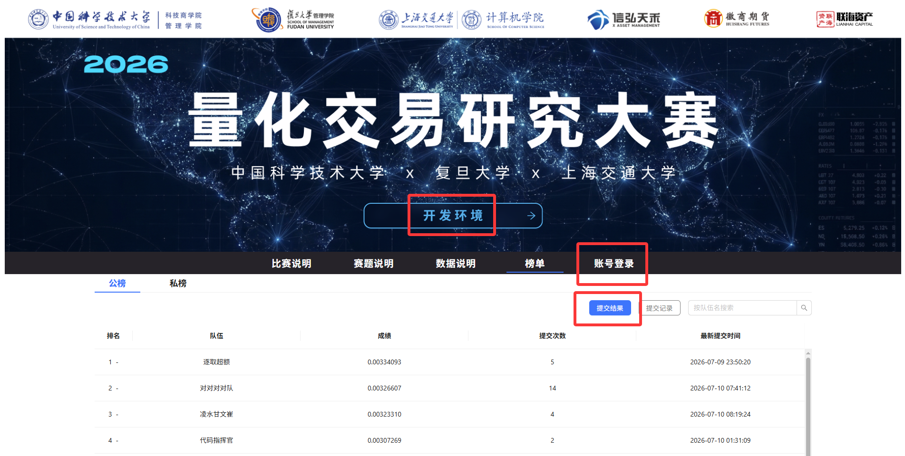

# 线上开发环境使用说明

**比赛门户网站**：https://race\.xhth\.cn

- **线上开发环境/提交结果 账号密码**：邮件发送

- **线上开发环境**：

    - JupyterLab 4\.4\.5

    - Python 3\.11\.15

        - numpy==1\.24\.3

        - pandas==2\.0\.3

        - pyarrow==11\.0\.0

        - scikit\-learn==1\.3\.0

    - CPU 8核 / 内存 12G / 单次使用时长上限 8 小时

    - 内存 oom 时终端会崩溃重启，请注意

- 榜单：

    - 提交结果计算完成后榜单会实时更新

    - 会相对当日0点的排名显示名次变化

## **计算资源与运行限制（Compute Resources）**

最终评测阶段将在官方统一环境中运行参赛者提交的策略代码。

参赛者可以使用外部资源进行模型训练，但最终提交必须能够在官方环境中稳定完成推理。

评测环境的具体配置说明如下：

|项目|说明|
|---|---|
|CPU|4 核|
|内存|12 GB|
|GPU|最终评测阶段不提供 GPU|
|外部网络|不允许访问|
|运行方式|通过 Time\\\-Series API 顺序推理|
|模型文件|允许加载随策略文件一并提交的预训练模型|
|运行时间限制|模型加载时间：180 s\ 单步`time_id`平均推理时间：50 ms|

## 微信群技术答疑联系人：

- 规则讲解：丁泽宇

- 环境资源：杨艾宸

- 门户网站：王进

